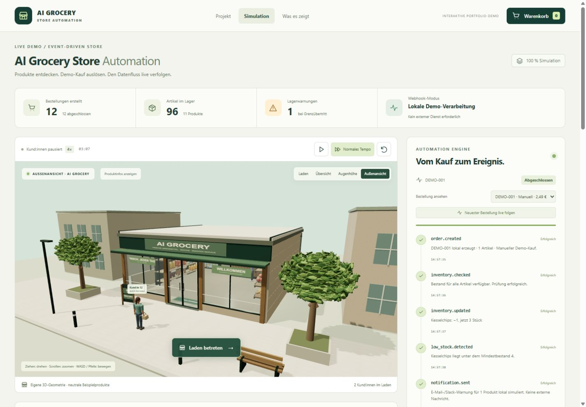
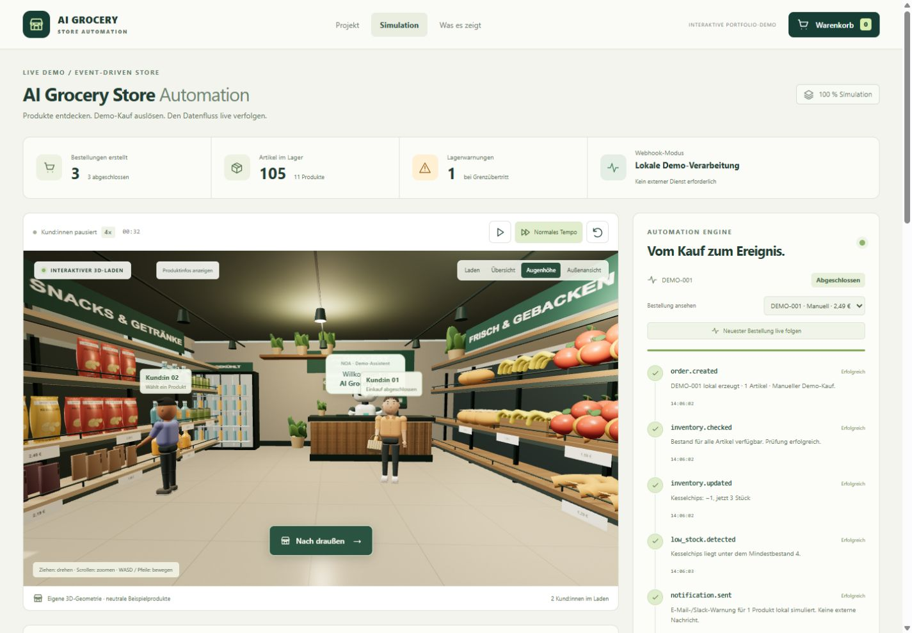
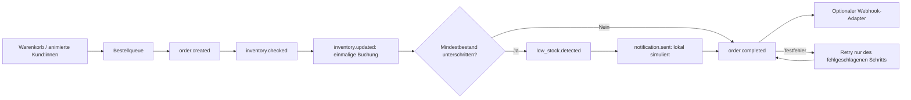

# AI Grocery Store Automation

Eine interaktive Portfolio-Demo, die einen 3D-Mini-Supermarkt mit einem sichtbaren, lokal simulierten Automationsprozess verbindet. Der Schwerpunkt liegt auf nachvollziehbarer Ereignisverarbeitung, korrekter Warenkorb- und Lagerlogik und beobachtbaren Workflows.

**For reviewers:** An interactive 3D store backed by a local event-driven order processor. Manual purchases and animated customers share the same inventory transaction, low-stock detection and observable workflow. A failed completion can be retried without charging inventory twice. React, TypeScript, React Three Fiber; no credentials required. This is a portfolio simulation, not a production shop or an AI service.

**Repository:** [Nico89x/ai-grocery-store-automation](https://github.com/Nico89x/ai-grocery-store-automation). Lokal geprüft; die erste GitHub-Pages-Veröffentlichung wird eingerichtet. [Veröffentlichung und Bewerbungspräsentation](PORTFOLIO.md).




**Portfolio-Demo – keine echte Bestellung und keine Zahlung.** Keine Anmeldung, keine personenbezogenen Daten, keine echte E-Mail-/Slack-Nachricht und keine KI-API. Alle Kundenfiguren, Produkte und Geschäftsvorgänge sind Beispiele. Ohne Webhook-Konfiguration verlässt kein Bestellereignis den Browser. Der Zustand liegt ausschließlich im Arbeitsspeicher und wird beim Neuladen zurückgesetzt.

## Starten

Voraussetzung: Node.js **22 oder neuer** und npm. Alternativ funktioniert pnpm mit dem enthaltenen Lockfile.

```bash
npm install
npm run dev
```

Die im Terminal ausgegebene lokale URL öffnen, standardmäßig `http://127.0.0.1:5173/`.

```bash
npm test          # Logik- und Adaptertests
npm run build    # TypeScript prüfen und Produktionsbuild erstellen
npm run preview  # Produktionsbuild lokal anzeigen, standardmäßig Port 4173
```

Mit pnpm: `pnpm install`, `pnpm dev`, `pnpm test`, `pnpm build`, `pnpm preview`. Das enthaltene `pnpm-workspace.yaml` erlaubt ausschließlich den notwendigen esbuild-Installationsschritt.

## Demo in zwei Minuten

1. **Simulation starten** öffnet die Simulationsansicht und startet nacheinander eintretende Kund:innen. Die Pause-Taste stoppt weitere Kundenbewegungen; bereits ausgelöste Bestellungen werden weiter verarbeitet.
2. Die Szene startet vor dem Geschäft: Schaufenster, Eingang, Dach, Gehweg und Nachbargebäude. **Laden betreten** oder ein Klick auf die Glastür wechselt nach innen. Auf die gelbe Chips-Packung oder das Etikett im 3D-Laden klicken. Die zugängliche Produktliste bietet dieselben Produktdetails.
3. **1 × Kesselchips Meersalz** in den Warenkorb legen. Initialbestand: 4; Mindestbestand: 4. Im Warenkorb Mengen ändern, Produkte entfernen und Einzelpreise/Gesamtsumme prüfen.
4. **Demo-Kauf auslösen**. Das Panel verarbeitet nacheinander `order.created`, `inventory.checked`, `inventory.updated`, `low_stock.detected`, `notification.sent` und `order.completed`.
5. Der Chips-Bestand sinkt auf **3**, also unter das Minimum. Dashboard und Workflow zeigen die Lagerwarnung. Die Benachrichtigung ist ein lokales Ereignis, keine tatsächlich versendete Nachricht.
6. **Fehler beim Workflow simulieren** aktivieren und einen weiteren manuellen Kauf auslösen. Der absichtliche Testfehler tritt bei `order.completed` auf, nachdem der Bestand bereits gebucht wurde.
7. **Erneut versuchen** setzt den fehlgeschlagenen Schritt fort. Erfolgreiche Schritte, Bestandsbuchungen und Warnungen werden nicht wiederholt. Der abgeschlossene Workflow zeigt Versuch 2.
8. Mit **Simulation beschleunigen** zwischen 1× und 4× wechseln. **Simulation zurücksetzen** setzt nach Bestätigung Bestände, Warenkorb, Kundenfiguren, Bestellungen und Logs zurück.

Die Warnung entsteht bei einem **Grenzübertritt** (`vorher >= Minimum`, `nachher < Minimum`). Weitere Käufe eines bereits niedrigen Bestands erzeugen keine doppelte Warnung. Bestellungen ohne Grenzübertritt haben vier Workflow-Schritte; Warnung und Benachrichtigung werden dann nicht benötigt. Pro Order lässt sich der vollständige Ablauf in der Auswahl erneut ansehen.

## Kamera und Mobilgeräte

- Maus ziehen: Kamera drehen. Scrollrad: zoomen. Rechte Maustaste ziehen: verschieben.
- WASD oder Pfeiltasten: horizontal durch die Szene bewegen, solange kein Eingabefeld oder Dialog fokussiert ist.
- **Außenansicht**, **Laden**, **Übersicht**, **Augenhöhe** setzen die Kamera auf eine feste Ansicht zurück. **Laden betreten** und **Nach draußen** wechseln zwischen Straße und Innenraum, ohne Warenkorb oder Bestellzustand zurückzusetzen. Der Kamerawechsel ist animiert; mit aktivierter Systemeinstellung „Bewegung reduzieren“ erfolgt er sofort.
- Die eigenen Figuren haben Gesichter, Frisuren, Knie- und Armbewegungen sowie eine Auswahlbewegung. Die Laufzeit entsteht aus Weglänge und einer Gehgeschwindigkeit von 1,18–1,36 m/s. Die Kundenfiguren kommen vom Gehweg durch eine automatische Schiebetür, wählen ihre Produkte und verlassen das Geschäft nach dem Demo-Kauf. Dach und Fassade sind außen und auf Augenhöhe geschlossen; die Ansichten **Laden** und **Übersicht** zeigen einen offenen Grundriss, damit Produkte und Abläufe gut erreichbar bleiben.
- Touch: ein Finger dreht, zwei Finger zoomen/verschieben. Vier zusätzliche Bewegungstasten erleichtern die mobile Navigation.
- Auf kleinen Bildschirmen folgen Workflow, Lagerbestand und Produktliste direkt unter der 3D-Szene. Dialoge haben Fokusbindung, Escape schließt sie. Produkte sind zusätzlich per Tastatur aus der Liste auswählbar.
- Bei fehlendem WebGL bleibt die Produktliste mit Warenkorb und Automation nutzbar.
- **Produktinfos anzeigen** blendet die im Raum verankerten Detailbuttons ein. Standardmäßig bleiben die schwebenden Preisschilder ausgeblendet; Waren und die Produktliste sind weiterhin anklickbar. Die 3D-Regale haben eigene Preisschienen.

## Verarbeitung auf einen Blick



Bewusste Entscheidungen: Ein reiner Reducer macht die Lagerlogik unabhängig vom 3D-Rendering testbar. Cent-Werte vermeiden Rundungsfehler. Eine Queue verhindert konkurrierende Teilbuchungen. Prozedurale Materialien und Modelle brauchen keine externen Asset-Server. Die simulierte KI-Assistenz ist bewusst regelbasiert. Der 3D-Bibliothekschunk wird separat geladen, bleibt aber die größte Downloadkomponente; auf schwächeren Geräten stehen die HTML-Produkte als alternative Bedienung bereit.

## Projektarchitektur

```text
src/
  App.tsx                      Start-/Simulationsansicht und Bedienung
  main.tsx                     React-Einstieg
  styles.css                   Responsives Layout, Dialoge, Kontraste
  domain/
    products.ts                Neutrale Produkte, Preise in Cent, Start-/Mindestbestand
    customerJourney.ts         Gemeinsame Laufwege, Türdurchgang und Gehgeschwindigkeit
    customerJourney.test.ts    Laufwege und Abstände zur Kasse prüfen
    simulation.ts              Reiner Reducer, Bestellqueue, Lagerbuchung, Kundenphasen
    simulation.test.ts         Tests für Käufe, Retry, Konkurrenz, Kunden und Webhook
  hooks/
    useSimulation.ts           Zeittakt und einmalige Webhook-Zustellung
  scene/
    StoreScene.tsx             React Three Fiber, Geometrie, Kamera und Kunden
    HumanShopper.tsx           Eigene Figuren mit Gelenken, Gesichtern und Greifbewegung
    StoreExterior.tsx          Fassade, Schaufenster, Schiebetür und Straßenraum
    GroceryProduct.tsx         Eigene Warengeometrie und neutrale Verpackungen
    Materials.tsx              Gemeinsame prozedurale Materialbibliothek
    ProductGeometry.ts         Verformte Warengeometrie mit begrenzten Koordinaten
    ProductGeometry.test.ts    Regressionstest für gültige 3D-Klickflächen
  components/
    WorkflowPanel.tsx          Ereignisse, Status, Retry und Protokoll
    Modal.tsx                  Native zugängliche Dialoge
    ProductArt.tsx             Selbst gestaltete Produktabbildungen
    Icon.tsx                   Eigene SVG-Symbole
  services/
    webhook.ts                 Einziger externer Erweiterungspunkt
```

React, TypeScript, Vite, Three.js, React Three Fiber und Drei. Die Ansichten sind über Hash-Routen (`#/` und `#/simulation`) auch auf einfachen statischen Servern nutzbar. Die 3D-Bibliotheken und Szene werden in getrennten Chunks geladen. Es gibt keine entfernten Fonts, HDR-Dateien, Bilder oder Produktmodelle: Geometrie, Verpackungsetiketten, Bodentextur, Illustrationen und Symbole werden selbst per Code erstellt.

Die Materialbibliothek erzeugt Holzmaserung, Stein, Putz und Backwarenkruste einmal pro Szene und gibt GPU-Texturen beim Abbau frei. Eine lokal gerenderte Lichtumgebung liefert Reflexionen ohne HDR-Download. Chipstüten sind verformte Netze, Flaschen Rotationskörper, Bananen und Croissants Kurvengeometrie. Blattgruppen der Straßenbäume verwenden Instancing. Die Darstellung ist detaillierte Echtzeit-3D-Grafik; sie ist kein fotorealistisches Offline-Rendering.

### Zustandsmodell und Garantien

- Produkte: ID, Kategorie, Preis in ganzen Cent, Beschreibung, Farbe/Form, Start- und Mindestbestand, Vegan-Kennzeichen und Regalposition.
- Warenkorb: Produkt-ID → positive ganzzahlige Menge, begrenzt durch den aktuell verfügbaren Bestand. Bei zwischenzeitlichen Kundenkäufen weist die UI auf zu hohe Warenkorbmengen hin.
- Orders: unveränderliche Preis-/Mengen-Snapshots, Quelle `manual`/`customer`, Gesamtpreis, Event-Schritte, Versuchszähler und `inventoryApplied`.
- Eine Queue verarbeitet Bestellungen nacheinander. Der aktuelle Bestand wird unmittelbar vor der gemeinsamen Buchung nochmals geprüft; es gibt keine Teilbuchung und keinen negativen Bestand. Keine Zahlung oder Reservierung.
- Erfolgreiche Buchungen werden beim Retry nicht erneut ausgeführt. Nach dem absichtlichen Testfehler wird ausschließlich der Abschluss wiederholt.
- Kundenphasen: Eintritt → Regal → Auswahl → Kasse → lokaler Kauf → Ausgang. Die Produkt-ID des gewählten Artikels landet in derselben Bestellqueue wie ein manueller Warenkorb.
- Warnung: eine pro Produkt und Grenzübertritt; Zeitstempel und Bezug zur Bestellung bleiben erhalten. Bei Reset wird das Lager aufgefüllt.
- Ereignisse: ausstehend/läuft/erfolgreich/fehlgeschlagen; Zeitstempel werden beim Start und Abschluss gesetzt. Pending-Schritte haben noch keinen Ausführungszeitpunkt.
- Der Zeitfaktor beschleunigt Kunden und Workflow. Kunden pausieren unabhängig von bereits ausgelösten Käufen. Lange Hintergrund-Pausen werden pro Tick begrenzt, damit die Verarbeitung nachvollziehbar bleibt.
- Maximal 60 automatische Bestellungen pro Sitzung; maximal drei sichtbare Kundenfiguren. Das Protokoll hält die jüngsten 150 Zustandswechsel, die Bestellhistorie bleibt für die Sitzung erhalten.

## Erweiterungspunkt für n8n

`src/services/webhook.ts` enthält `deliverOrder()` und `orderPayload()`. Die lokale Verarbeitung ist immer maßgeblich. Erst nach `order.completed` wird optional ein Demo-Ereignis gesendet. **Ohne URL wird überhaupt kein Request ausgeführt**, und die UI zeigt **Lokale Demo-Verarbeitung**.

Optional `.env.example` nach `.env.local` kopieren:

```dotenv
VITE_AUTOMATION_WEBHOOK_URL=https://dein-testserver.example/webhook/grocery-demo
```

Danach Vite neu starten bzw. den Build neu erstellen. n8n: einen POST-Webhook einrichten, JSON entgegennehmen und nach `idempotencyKey` deduplizieren. Der Browser benötigt eine passende CORS-Freigabe des Testendpunkts. Erst bei erfolgreicher HTTP-Antwort zeigt das Dashboard **Webhook verbunden**. Timeout nach fünf Sekunden, HTTP-Fehler oder eine ungültige URL führen zum lokalen Fallback; die bereits abgeschlossene Lagerbuchung bleibt korrekt.

Beispielpayload:

```json
{
  "schemaVersion": 1,
  "demo": true,
  "event": "order.completed",
  "idempotencyKey": "SITZUNGS-ID:DEMO-001",
  "order": {
    "id": "DEMO-001",
    "source": "manual",
    "createdAt": "2026-10-07T10:00:00.000Z",
    "totalCents": 249,
    "items": [{ "productId": "chips", "quantity": 1, "unitPrice": 249 }]
  },
  "lowStockProducts": ["chips"]
}
```

`VITE_*`-Werte sind öffentlich im Browserbuild. Keine API-Schlüssel oder Geheimnisse eintragen. Für eine spätere echte Integration: eigener Backend-Proxy, Authentifizierung und serverseitige Prüfung/Deduplizierung ergänzen. Auch dann darf diese Portfolio-Demo nur gekennzeichnete Testdaten senden. Die aktuell bereitgestellte Version hat keinen konfigurierten externen Endpunkt.

## Verifikation

Automatische Tests prüfen Cent-Berechnung, Mengenbegrenzung, sechs erfolgreiche Events inklusive Chips-Warnung, Retry nach Buchung ohne doppelten Abzug, Konkurrenz ohne negative/teilweise Bestände, bedingte Warnungen, automatische Kundenbestellungen, Reset, lokalen Betrieb ohne Requests, Webhook-Ausfall und erfolgreichen Payload.

Aktuell **12 Tests**: neun für Bestellverarbeitung und Adapter, zwei für Laufwege und Gehgeschwindigkeit, einer gegen ungültige Koordinaten an den verformten Verpackungsrändern. Die GitHub-Dateien unter `.github/workflows/` führen Installation mit festem Lockfile, Tests und Build aus. Der Pages-Workflow ist standardmäßig deaktiviert, bis die Veröffentlichung bewusst eingerichtet wird; siehe `PORTFOLIO.md`.

Manueller Prüflauf: Startansicht → 3D-Auswahl → Produktdetails → Warenkorb → +/−/Entfernen → Demo-Kauf → Bestand 4→3 → Warnung → sechs erfolgreiche Events. Zusätzlich Fehler/Retry, Kundenkäufe bei 4×, Kameraansichten, Schnellfragen und mobile Dialoge prüfen. Ein echter n8n-Endpunkt gehört nicht zum Lieferumfang; der Adapter wird mit einem simulierten Transport getestet.

## Sinnvolle nächste Erweiterungen

- Eigener n8n-Testworkflow mit lokaler Persistenz und serverseitiger Idempotenz.
- Simulierte Nachbestellung und Wareneingang als zusätzliche Events.
- Exportierbare Demo-Reports, weitere Kundenstrategien und Szenarien.
- Feinere Geometrie, eigene Materialtexturen und adaptive Grafikqualität für schwächere Geräte.
